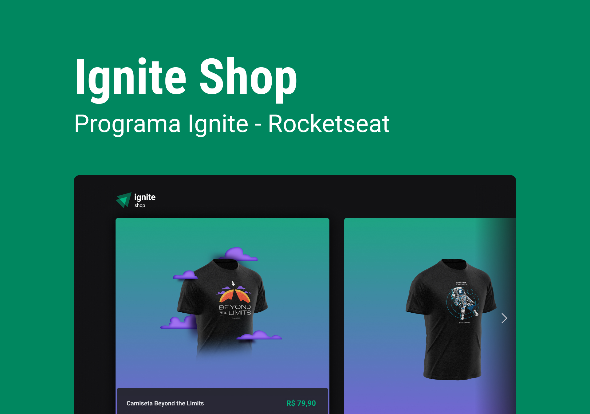

<h1 align="center"> Ignite Shop </h1>

Quarto projeto desenvolvido durante o bootcamp Ignite da Rocketseat.

  <a href="#-projeto">Projeto</a>&nbsp;&nbsp;&nbsp;|&nbsp;&nbsp;&nbsp;
  <a href="#-tecnologias">Tecnologias</a>&nbsp;&nbsp;&nbsp;|&nbsp;&nbsp;&nbsp;
  <a href="#-como-executar">Como executar</a>&nbsp;&nbsp;&nbsp;|&nbsp;&nbsp;&nbsp;
  <a href="#-layout">Layout</a>

 

  

## 💻 Projeto

O Ignite Shop é uma aplicação de e-commerce para venda de camisetas com estampas da Rocketseat.
## ✨ Tecnologias

Esse projeto foi desenvolvido com as seguintes tecnologias:

- Next.js
- Stitches
- Stripe

## 🚀 Como executar

Para executar a aplicação é necessário usar os seguintes comandos no terminal:

- `pnpm install` para instalar as dependências da aplicação.
- `pnpm dev` para executar a aplicação.

## 🔖 Layout

Você pode visualizar o layout do projeto através [DESSE LINK](https://www.figma.com/file/SxLD8qTQUyCu3GAafEABFH/Ignite-Shop?node-id=0%3A1&t=GUC7gNZapLvEUcOa-1).
